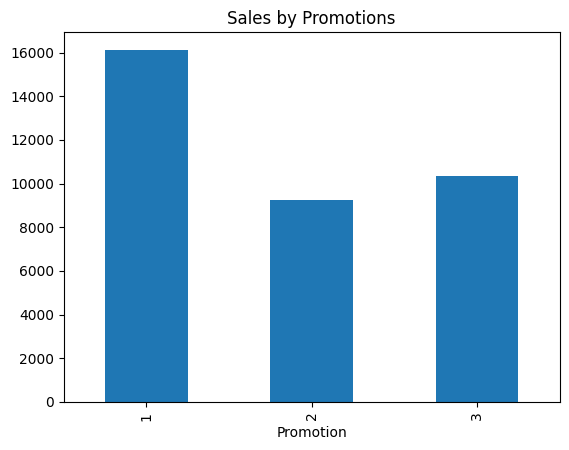
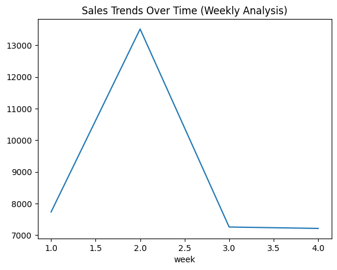
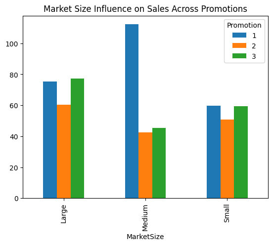
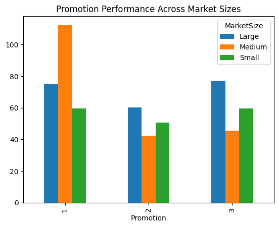
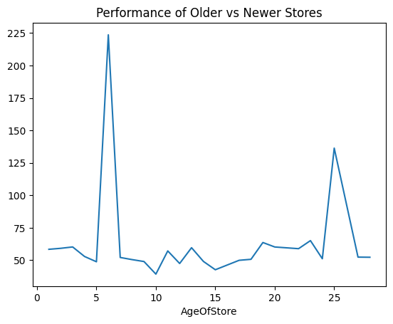
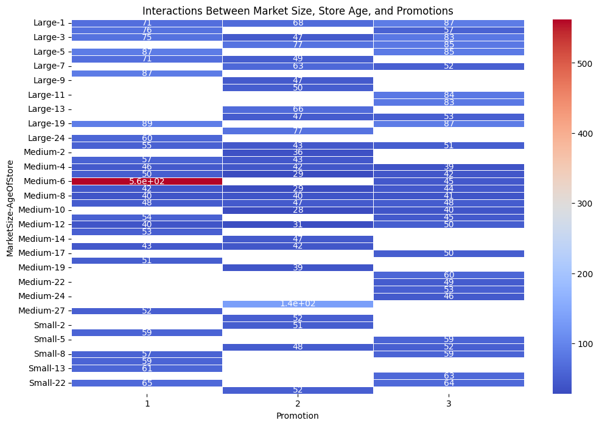
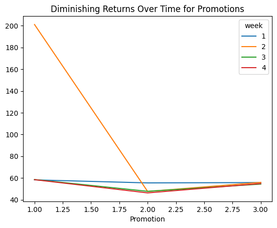
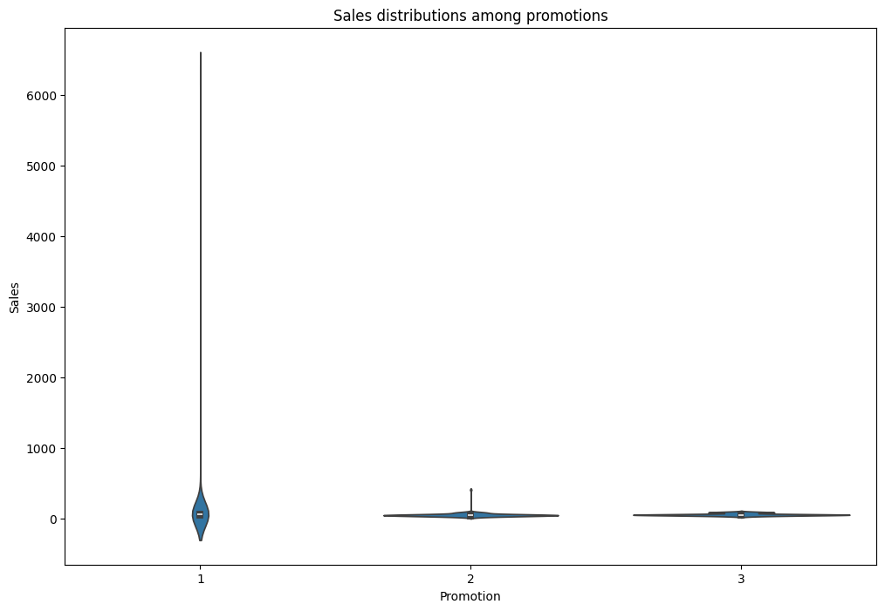

# Marketing Campaign Analysis for adding a new item
*- by Data diwan's (Group 1)*

## Overview
This reprot evaluate the effectiveness of three marketing promotions for a new fast-food item, we analyze sales data collected from multiple market locations. Our goal was to determine which promotion yielded the best results and explore how other factors, such as market size and store age, influence sales.

---

## Data Description
- **MarketID**: Unique identifier for each market.
- **MarketSize**: Size of the market area by sales (e.g., Small, Medium, Large).
- **LocationID**: Unique identifier for each store location.
- **AgeOfStore**: Age of the store in years.
- **Promotion**: Type of promotion used (Promotion 1, 2, or 3).
- **Week**: Week number when the sales data were collected (Week 1 to Week 4).
- **SalesInThousands**: Sales amount in thousands for a given store, promotion, and week.

## Steps for Conducting the Analysis
1. Clean and preprocess the dataset to handle missing values and data inconsistencies.
2. Perform exploratory data analysis (EDA) to understand sales trends.
3. Evaluate the effectiveness of each promotion using statistical analysis.
4. Provide insights and recommendations for policymakers based on the findings.

---

## Data Cleaning

Since the data provided by the data engineering team had some inconsistencies and errors, it needed to be cleaned and preprocessed before proceeding with the analysis.

Here are some of the steps taken to ensure the data was clean and ready for analysis

1. **Addressing Missing Information**: We filled in any gaps in the data where possible or ensure the analysis was based on complete and accurate information.
2. **Eliminating Duplicates**: We removed repeated entries to make sure the results were not skewed by duplicate data points.
3. **Ensuring Consistency**: Numbers, caterogies, and other formats were standardized so all data followed the same structure, making it easier to interpret and analyze.
4. **Dealing with Unusual Data Points**: We identified and addressed any outliers or anomalies to avoid them distorting the overall trends and findings.

---

# Data Findings

## 1. Total Sales by Each Promotion

- **Observation**: Promotion 1 has the highest total sales, followed by Promotion 3, and Promotion 2 has the lowest total sales.

## 2. Sales Trends Over Time (Weekly Analysis)

- **Observation**: Sales peaked in week 2, then dropped significantly in week 3 and remained stable in week 4.

## 3. Influence of Market Size on Sales Across Different Promotions

- **Observation**: Medium-sized markets have the highest average sales across all promotions, while small markets have the lowest average sales.

## 4. Consistency of Promotion Performance Across Market Sizes

- **Observation**: Promotion 1 performs consistently well across all market sizes, while Promotion 2 performs better in medium and large markets.

## 5. Performance of Older Stores (High AgeOfStore) Compared to Newer Stores

- **Observation**: Older stores (with higher AgeOfStore) tend to have higher average sales compared to newer stores except the 5-7 ages.

## 6. Interactions Between Market Size, Store Age, and Promotions

- **Observation**: There are significant interactions between market size, store age, and promotions. For example, Promotion 1 performs exceptionally well in medium-sized markets with older stores.

## 7. Signs of Diminishing Returns Over Time for Promotions

- **Observation**: Promotion 1 shows signs of diminishing returns over time, with sales peaking in week 2 and then declining.

## 8. Sales Distributions Among Promotions

- **Observation**: Promotion 1 has a wider distribution of sales, indicating variability in its effectiveness. Promotion 2 has a more consistent sales distribution.

# Recommendations

1. **Focus on Promotion 1** : Prioritize Promotion 1 due to its high total sales and broad market performance.

2. **Target Medium-Sized Markets** : Medium-sized markets yield the highest average sales; focus promotions here.

3. **Optimize Timing of Promotions** : Adjust promotion timing to maintain sales momentum beyond week 2.

4. **Tailor Promotions for Older Stores** : Customize promotions for older stores to leverage their higher performance.

5. **Monitor Diminishing Returns** : Keep an eye on diminishing returns for Promotion 1 and adjust strategies accordingly.

6. **Improve Consistency of Promotions** : Work on making Promotion 1 more consistent to achieve stable sales results.

7. **Leverage Interactions Between Factors** : Use the interactions between market size, store age, and promotions to design targeted strategies.

---
## Files in Repository

- **`Marketing_campain.ipynb, main.pynb`**  
  *This is the Jupyter Notebook containing the complete analysis of fast food chain data for marketing campaigns to add a new item to its menu.*

- **`marketing_campaign.xlsx`**  
  *The dataset used for the analysis, containing data regarding the weekly sales of the new item based on Market, Location, Market Size, Age of Store, Week of month and Promotion used at each location.*

---

## Instructions for Use

1. Open the [Marketing_campain.ipynb](Marketing_campain.ipynb) and [main.ipynb](main.ipynb) notebook in JupyterLab or any other compatible tool.  
2. Make sure you have all the required Python libraries installed, like pandas, numpy, seaborn, and matplotlib.  
3. Run through the cells step by step to see the analysis and create the visualizations and Explore the results presented in the visualizations and summary sections.

---

## Data Sources

- **Marketing Campaigns**: This dataset tracks the launch of a new item at various locations in randomly chosen markets. Each location tries out a different promotional strategy, and the weekly sales are recorded for the first four weeks to see how the product performs..
- **Source**: [DataSet](https://docs.google.com/spreadsheets/d/16BVW1O-BigWJLh6YNEVqNmIcIOn-loWZDHxw8F0wI40/edit?usp=sharing).

---

## Requirements

You can install the necessary dependencies using `pip`:

```bash
pip install numpy pandas seaborn plotly seaborn matplotlib  
```

---
## Team Members

- This analysis was conducted by the Barham,Hossien Mohamed,Mayur and Ayeesha

---